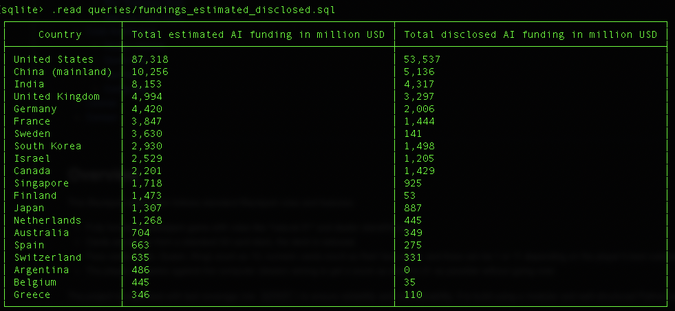
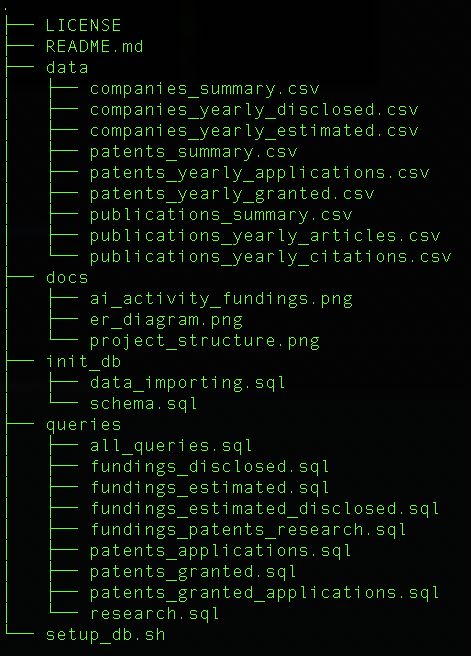
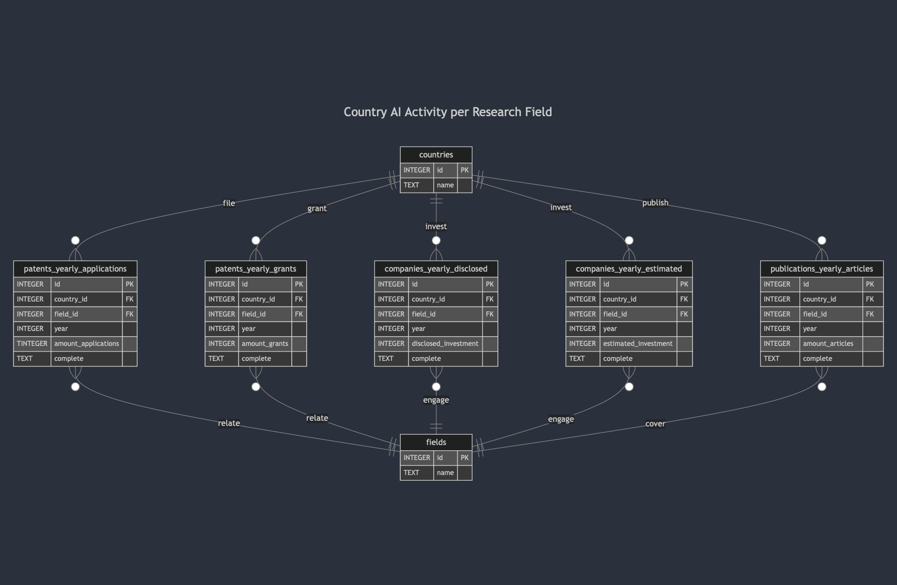

# Global AI Activity Tracking DB
[]() []()  []() []()  


A structured SQLite-based database designed to capture, analyze, and track global AI trends, including patent filings, academic publications, and financial investments. Gain insights into the evolving AI landscape with a scalable and optimized schema for cross-country and field-specific analysis.

---



---
## Table of Contents
- [Overview](#overview)  
- [Project Structure](#project-structure)
- [Features](#features)
- [Setup](#setup)
  - [Prerequisites](#prerequisites)
  - [Installation](#installation)
  - [Use the DB](#use-the-db)
- [Scope & Data](#scope--data)
- [Representation](#representation)
  - [Entities](#entities)
  - [Relationships](#relationships)
- [Provided Queries](#provided-queries)
- [Architecture](#architecture)  
  - [General](#general)
  - [Optimizations](#optimizations)
  - [Data processing / Importing](#data-processing--importing)
- [Data Attribution](#data-attribution)
- [License](#license)  
- [Contact](#contact)

---

## Overview
A structured SQLite database to track global AI trends, featuring:
- Cross-country and field-specific insights on patents, investments, and publications.
- Time-series analysis to monitor AI growth year by year.
- Optimized schema for efficient querying with pre-defined SQL queries.
- Data sourced from the [Emerging Technology Observatory](https://cat.eto.tech/) in Dez. 2024.

---
## Features
- **Comprehensive Coverage**: Tracks AI activity through patents, investments, and publications.
- **Scalable Schema**: Normalized tables for efficiency and ease of maintenance.
- **Pre-built Queries**: Includes pre-written SQL files for common analyses.
- **Open Data Source**: Uses public domain data for transparency and reproducibility.
---

## Project Structure


---

## Setup

### Prerequisites
- SQLite 3.8+
- A terminal or command-line interface

### Installation
1. Clone the repository:
```bash
git clone https://github.com/kenobijr/global_ai_activity.git
cd global_ai_activity
```
#### Option 1: Automatic Setup
1. Make the provided bash script executable:
```bash
chmod +x setup_db.sh
```
2. Run the script:
```bash
bash setup_db.sh
```
#### Option 2: Manual Setup
1.	Create the database schema:
```bash
sqlite3 ai_activity.db < init_db/schema.sql
```
2. Import the data:
```bash
sqlite3 ai_activity.db < init_db/data_importing.sql
```

### Use the DB
You can now use SQLite or any database client to interact with the ai_activity.db database and run queries
```bash
sqlite3 ai_activity.db
```
---

## Scope & Data

The primary purpose of this database is to capture and track global AI-related activity across multiple dimensions, including intellectual property (patent applications and grants), academic output (research publications), and financial investments (both disclosed and estimated). Data source a is a set of `.csv` files published by the “Emerging Technology Observatory” at Georgetown University. (https://cat.eto.tech/).
The raw CSV data was downloaded from the Emerging Technology Observatory in **Dez. 2024**. Check out this page for more information about the data source: https://eto.tech/dataset-docs/country-ai-activity-metrics/.

**In-Scope Entities**
- **Countries**: Each country in the world (or in the data source) that participates in AI-related activities, such as patent filing and research publications.
- **Research Fields**: Specific AI-related or technology-related fields, such as Machine Learning, Natural Language Processing, Computer Vision, etc.
- **Yearly Patent Activities**: Yearly counts of patent applications and grants across fields and countries.
- **Yearly Investment Data**: Disclosed and estimated investments in AI companies, organized by country, field, and year.
- **Yearly Publications**: Research articles published in AI fields, aggregated by country, field, and year.

**Out-of-Scope**
- **Granular Company-Specific Details**: While annual disclosed and estimated investments are tracked, no names or profiles of individual AI companies are stored.
- **Detailed Patent Metadata**: Patent text, claim details, or patent examiners’ information are not included.
- **Research Article Citation Networks**: Aggregated publication counts are stored, but not citation references or co-author networks.
- **Demographic or Socio-Economic Data**: Although these factors might influence AI activity, population data, GDP, or demographic distribution are not tracked here.

---

## Representation

### Entities
The database is focused on six main tables representing different aspects of AI-related activity, plus auxiliary tables for reference data and views for optimized querying.

1. **Countries**
   - **Attributes**: `id (INTEGER, PK)`, `name (TEXT, UNIQUE, NOT NULL)`
   - **Reasoning**: A separate `countries` table was created to avoid repeating country names throughout the dataset. The `id` is the primary key referenced by other tables. Uniqueness is enforced on the name to avoid duplicates.

2. **Fields**
   - **Attributes**: `id (INTEGER, PK)`, `name (TEXT, UNIQUE, NOT NULL)`
   - **Reasoning**: Analogous to "Countries" , a `fields` table for the various AI research areas or technology fields is created.

3. **Patents Yearly Applications**
   - **Attributes**:
     - `id (INTEGER, PK)`
     - `country_id (INTEGER, FK -> countries.id)`
     - `field_id (INTEGER, FK -> fields.id)`
     - `year (INTEGER NOT NULL)`
     - `amount_applications (INTEGER NOT NULL)`
     - `complete (TEXT CHECK(complete IN ("True","False")))`
   - **Reasoning**: This table represents the annual count of patent applications. `NOT NULL` is enforced on crucial metrics (year and amount_applications) to ensure data is always present. The `complete` column is used to indicate data completeness.

4. **Patents Yearly Granted**
   - **Attributes**:
     - `id (INTEGER, PK)`
     - `country_id (INTEGER, FK -> countries.id)`
     - `field_id (INTEGER, FK -> fields.id)`
     - `year (INTEGER NOT NULL)`
     - `amount_grants (INTEGER NOT NULL)`
     - `complete (TEXT CHECK(complete IN ("True","False")))`
   - **Reasoning**: Similar to patent applications, but for granted patents. This separation enables to distinguish between patent pipeline volume (applications) vs. completed results (grants).

5. **Companies Yearly Disclosed**
   - **Attributes**:
     - `id (INTEGER, PK)`
     - `country_id (INTEGER, FK -> countries.id)`
     - `field_id (INTEGER, FK -> fields.id)`
     - `year (INTEGER NOT NULL)`
     - `disclosed_investment (INTEGER NOT NULL)`
     - `complete (TEXT CHECK(complete IN ("True","False")))`
   - **Reasoning**: Stores official or publicly disclosed investment data. Having a separate table for disclosed vs. estimated investments allows users to compare the difference between official statements and approximate valuations.

6. **Companies Yearly Estimated**
   - **Attributes**:
     - `id (INTEGER, PK)`
     - `country_id (INTEGER, FK -> countries.id)`
     - `field_id (INTEGER, FK -> fields.id)`
     - `year (INTEGER NOT NULL)`
     - `estimated_investment (INTEGER NOT NULL)`
     - `complete (TEXT CHECK(complete IN ("True","False")))`
   - **Reasoning**: Some investments may not be fully disclosed publicly, so estimations are important for capturing the broader picture of AI funding. Disclosed funding is included in it.

7. **Publications Yearly Articles**
   - **Attributes**:
     - `id (INTEGER, PK)`
     - `country_id (INTEGER, FK -> countries.id)`
     - `field_id (INTEGER, FK -> fields.id)`
     - `year (INTEGER NOT NULL)`
     - `amount_articles (INTEGER NOT NULL)`
     - `complete (TEXT CHECK(complete IN ("True","False")))`
   - **Reasoning**: Tracks the volume of research articles published per country and field, by year. This metric is a proxy for research output and academic interest in AI.

### Relationships

All fact tables (patents, investments, publications) share a consistent referencing of `countries.id` and `fields.id`.

Below is the ER-Diagram:



---

## Provided Queries
This project includes a collection of pre-written SQL queries in the dir [`/queries`](queries/) designed to analyze and explore the database. The whole collection is provided in [`all_queries.sql`](queries/all_queries.sql) All other .sql files provide one single query.

- `all_queries.sql`: Combines all individual queries into one file for convenience.  
- `fundings_disclosed.sql`: Analyze disclosed investments by country, year, and research field.  
- `fundings_estimated.sql`: Extract estimated funding data for analysis of AI investments.  
- `fundings_estimated_disclosed.sql`: Compare disclosed and estimated funding across countries and fields.  
- `fundings_patents_research.sql`: Combine patents, investments, and publications for a comprehensive analysis.  
- `patents_applications.sql`: Retrieve yearly patent applications grouped by country and research field.  
- `patents_granted.sql`: Count granted patents across countries, fields, and years.  
- `patents_granted_applications.sql`: Compare patent applications and grants by country, field, and year.  
- `research.sql`: Explore research publication trends by country, field, and year.  

How to use the Queries:

### Option 1: Run Individual Queries
You can run any specific query directly using the SQLite command-line interface. For example:
```bash
sqlite3 ai_activity.db < queries/fundings_disclosed.sql
```
### Option 2: Explore All Queries
Run all provided queries at once using the combined all_queries.sql file:
```bash
sqlite3 ai_activity.db < queries/all_queries.sql
```
### Option 3: Copy and Paste Queries
1.	Open any .sql file in a text editor or IDE.
2.	Copy the desired query and execute it manually in the SQLite shell:
```bash
sqlite3 ai_activity.db
```
---

## Architecture

### General

The database uses a normalized SQLite schema designed for scalability and efficiency:  
- **Reference Tables**: `countries` and `fields` store unique country names and AI research fields, ensuring data consistency and avoiding redundancy.  
- **Fact Tables**: Six main tables capture yearly metrics for patents (applications and grants), investments (disclosed and estimated), and research publications, each referencing the `countries` and `fields` tables.  
- **Indexes**: Key columns like `year` are indexed for fast querying, especially for trend analysis.  
- **Views**: Predefined views simplify access to commonly joined data, such as combining publication metrics with country and field names.  

This modular design ensures the database is easy to query, maintain, and extend.  

### Optimizations
To enhance performance, especially when filtering by year, indexes on the `year` columns in each fact table were created:

- `publications_per_year` on `publications_yearly_articles(year)`
- `disclosed_funding_per_year` on `companies_yearly_disclosed(year)`
- `estimated_funding_per_year` on `companies_yearly_estimated(year)`
- `applied_patents_per_year` on `patents_yearly_applications(year)`
- `granted_patents_per_year` on `patents_yearly_granted(year)`

These indexes significantly reduce query time for year-based filters. Furthermore, implemented a **view** named `v_publications` was created to make it easier for users to select all publication records alongside descriptive country and field names, rather than performing manual joins each time.

### Data processing / Importing

To populate the database, each `.csv` will be imported; the queries are saved in "data_importing.sql".
1. **Country and Field Reference Tables**: A cleaning script deduplicates and inserts each unique country or field into the respective tables.
2. **Fact Tables**: Rows from the `.csv` files are inserted into the relevant fact tables (e.g., `patents_yearly_applications`, `patents_yearly_granted`) with references to the `id` of the corresponding country and field.
3. **Normalization Decision**: Decision to normalize the data by separating countries and fields to reduce redundancy was taken. This design means that queries typically involve joins, but it also ensures that changes or corrections to country or field names are globally consistent.

Certain summary tables and publication citations were dropped from this initial design to keep the database focused on high-level AI metrics.

---

## Data Attribution
This project uses data from the "Emerging Technology Observatory Country Activity Tracker: Artificial Intelligence," provided by the [Emerging Technology Observatory](https://cat.eto.tech/) (ETO) at Georgetown University , licensed under Creative Commons Attribution-NonCommercial 4.0.

- [Dataset Documentation](https://eto.tech/dataset-docs/country-ai-activity-metrics/)
- License: [CC BY-NC 4.0](https://creativecommons.org/licenses/by-nc/4.0/)

This project is **non-commercial** and not affiliated with or endorsed by ETO.

---

## License
This project is licensed under the MIT License. See the [LICENSE](LICENSE) file for more details.

---

## Contact
Feel free to reach out for collaboration or questions:

https://github.com/kenobijr

[mail](mailto:22.scree_rhino@icloud.com)
